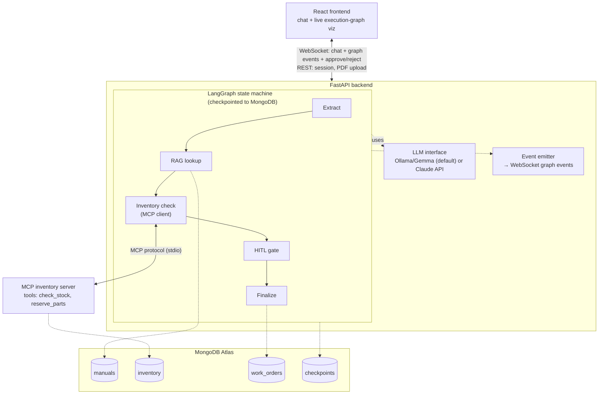
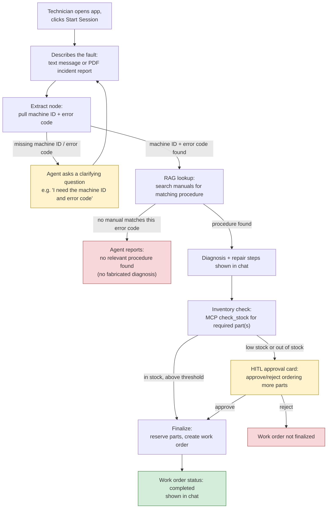

# Industrial Machinery Maintenance & Diagnostics Agent

A portfolio/demo project: a factory technician reports a machine error (text
or PDF log), and an agentic AI system diagnoses the fault via RAG over
technical manuals, checks spare-parts inventory through an MCP server,
pauses for human approval when parts must be ordered, and generates a work
order on approval.

This is a demo, not a production tool — it exists to showcase an agentic AI
architecture: a LangGraph state machine, RAG, MCP tool use, human-in-the-loop
(HITL) pause/resume, and a live execution-graph visualization.

Full design spec: [`docs/superpowers/specs/2026-09-10-industrial-maintenance-agent-design.md`](docs/superpowers/specs/2026-09-10-industrial-maintenance-agent-design.md)

## Architecture



## User Journey



Built in three phases, each a standalone package:

| Phase | Package | What it is |
|---|---|---|
| 1 | [`mcp_server/`](mcp_server/) | Standalone MCP server exposing `check_stock`/`reserve_parts` inventory tools over stdio |
| 2 | [`backend/`](backend/) | LangGraph workflow + FastAPI/WebSocket API (chat, PDF upload, HITL approval, work orders) |
| 3 | [`frontend/`](frontend/) | React/Vite/TypeScript UI: chat + live execution-graph visualization |

Design/implementation history for each phase lives under
[`docs/superpowers/plans/`](docs/superpowers/plans/) and
[`docs/superpowers/specs/`](docs/superpowers/specs/).

## Prerequisites

- Python 3.11+ (3.12 recommended)
- Node.js 18+
- MongoDB Atlas cluster (Atlas Vector Search must be available on the
  cluster tier — the `manuals` collection's search index itself is created
  automatically the first time you seed manuals, see below)
- One of:
  - [Ollama](https://ollama.com) running locally (default LLM backend), or
  - an Anthropic API key (for the "Claude API" backend toggle)

## Setup

Copy `.example.env` to `.env` at the repo root and fill in real values:

```bash
cp .example.env .env
```

| Variable | Required | Notes |
|---|---|---|
| `MONGODB_URI` | Yes | Full Atlas connection string |
| `MONGODB_DB` | No | Defaults to `machine_repair` |
| `MONGODB_USERNAME` / `MONGODB_PASSWORD` | No | Only if you assemble `MONGODB_URI` from these yourself |
| `ANTHROPIC_API_KEY` | Only for the Claude backend | Not needed for the default local Ollama backend |

### 1. MCP inventory server (Phase 1)

```bash
cd mcp_server
python3 -m venv .venv && .venv/bin/pip install -e ".[dev]"
.venv/bin/mcp-inventory-server seed    # loads synthetic parts data
.venv/bin/pytest                       # run tests
```

The FastAPI backend spawns `mcp-inventory-server serve` as a stdio
subprocess automatically — you don't run it standalone except for seeding
or testing.

### 2. Backend (Phase 2)

```bash
cd backend
python3 -m venv .venv && .venv/bin/pip install -e ".[dev]"
.venv/bin/pytest                       # run tests

# Seed synthetic manuals (once) — this also creates the Atlas Vector
# Search index on first run if it doesn't already exist. The index takes
# a few seconds to become queryable after creation (Atlas builds it
# asynchronously); RAG lookups will return "no relevant procedure found"
# for everything until it's ready.
.venv/bin/python3 -c "
from backend.db import get_manuals_collection
from backend.rag.manuals_seed import seed_manuals
seed_manuals(get_manuals_collection())
"

.venv/bin/uvicorn backend.api.app:app --reload
```

Runs at `http://localhost:8000`. Exposes:
- `POST /upload` — PDF upload, returns extracted text
- `POST /manuals/upload` — upload a technical manual PDF (with
  `machine_type`/`error_codes` form fields); chunks, embeds, and inserts
  it into the searchable knowledge base
- `GET /manuals` — list previously-uploaded manuals
- `WS /ws/{thread_id}?backend=local|cloud` — chat session (`local` = Ollama, `cloud` = Claude)

### 3. Frontend (Phase 3)

```bash
cd frontend
npm install
npm test    # run tests
npm run dev
```

Vite's dev server proxies `/upload`, `/manuals`, and `/ws` to `http://localhost:8000` —
start the backend first. Open the printed local URL, click **Start
Session**, and chat.

## Running the full stack locally

```bash
# Terminal 1
cd mcp_server && .venv/bin/mcp-inventory-server seed   # once, to seed inventory

# Terminal 2
cd backend
.venv/bin/python3 -c "
from backend.db import get_manuals_collection
from backend.rag.manuals_seed import seed_manuals
seed_manuals(get_manuals_collection())
"   # once, to seed manuals + create the vector search index
.venv/bin/uvicorn backend.api.app:app --reload

# Terminal 3
cd frontend && npm run dev
```

## Tech stack

- **MCP server:** Python, official `mcp` SDK (`FastMCP`), `pymongo`, `mongomock` (tests)
- **Backend:** Python, FastAPI, LangGraph + `langgraph-checkpoint-mongodb`, `ollama`/`anthropic` clients, `sentence-transformers` (local embeddings), `pypdf`
- **Frontend:** React 18, Vite, TypeScript, Tailwind CSS, Zustand, Vitest + React Testing Library

## Testing

Each package has its own test suite; there is no top-level test runner.

```bash
cd mcp_server && .venv/bin/pytest
cd backend && .venv/bin/pytest
cd frontend && npm test
```

No CI workflow is configured yet (`.github/workflows/` doesn't exist) — run
the suites above locally before pushing.

## Author

[AliAlTaweel](https://github.com/AliAlTaweel)

## Non-goals

Explicitly out of scope for this demo (see the design spec for the full
list): auth/authorization, multi-tenant roles, horizontal scaling, OCR for
scanned PDFs, a real inventory system (synthetic seed data) — technical
manuals can now be supplemented with real uploads via the "Manage
Manuals" panel, though the seeded set remains synthetic — and a separate
supervisor login (the same chat
session shows the approval card inline).
